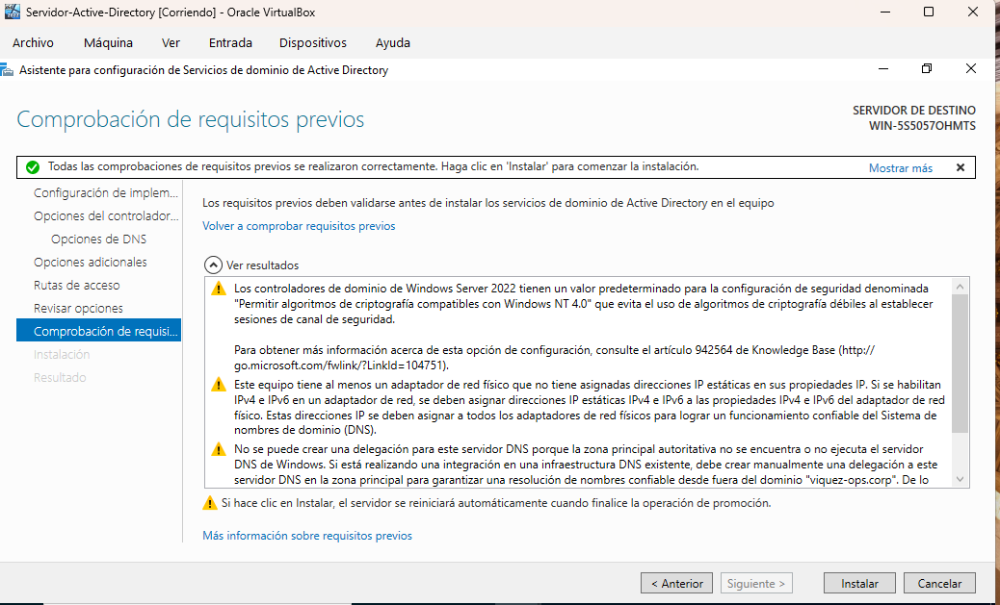
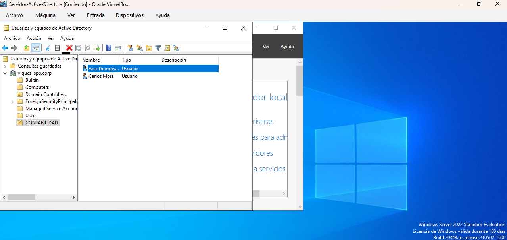

# 💽 Manual de Virtualización de Sistemas e Infraestructura de Servidores (Windows Server)
Este módulo contiene la documentación técnica de mis laboratorios prácticos orientados a la implementación de entornos virtualizados (Hipervisores), aprovisionamiento de sistemas operativos de servidor y la promoción de Controladores de Dominio (Domain Controllers) locales.

## 📋 Laboratorio 6.1: Despliegue de Entorno Virtual y Activación de Active Directory Services
**Objetivo:** Configurar una arquitectura de hardware virtualizado utilizando un hipervisor de Tipo 2, instalar de forma limpia un sistema operativo de servidor empresarial e implementar los Servicios de Dominio de Active Directory (AD DS) bajo un bosque lógico independiente.

### ⚙️ 1. Asignación de Recursos y Arquitectura del Hipervisor (Oracle VM VirtualBox)
Para garantizar la estabilidad del servidor local sin comprometer el rendimiento del host físico, se estructuró una máquina virtual con los siguientes parámetros base:
* **Hipervisor:** Oracle VM VirtualBox v7.0
* **Sistema Operativo Guest:** Windows Server 2022 Standard Evaluation (Experiencia de Escritorio)
* **Cálculo de Hardware Virtual:** 4 GB de Memoria RAM (Base de Datos Indexada) y 2 CPUs Core asignados de forma dedicada.
* **Almacenamiento:** Disco Duro Virtual de 50 GB aprovisionado dinámicamente.
* **Optimización Visual:** Instalación de controladores avanzados mediante *Guest Additions* para forzar el autoajuste de resolución a pantalla completa y habilitar la aceleración de video.

### 🌿 2. Promoción del Servidor a Controlador de Dominio (Domain Controller)
Tras concluir la carga del sistema operativo perimetral, se procedió a elevar los privilegios de la máquina mediante la inyección del rol de infraestructura en el panel central de administración (*Server Manager*):
1. **Inyección del Rol:** Activación de los **Servicios de dominio de Active Directory (AD DS)** instalando los binarios y las consolas de administración remota de servidores (RSAT).
2. **Arquitectura de Red Corporativa:** Configuración de una directiva de infraestructura de tipo **"Agregar un nuevo bosque" (Add a new forest)**.
3. **Bautizo del Espacio de Nombres Global:** Implementación del dominio local independiente bajo la nomenclatura corporativa: **`viquez-ops.corp`**.
4. **Auditoría de Requisitos Previos:** Ejecución del motor de validación interno de Microsoft, obteniendo aprobación técnica total (Barra Verde) para la inyección de bloques lógicos en el sistema de producción.
5. 
## 📸 Evidencia del Laboratorio (Auditoría de Requisitos Previos de Microsoft)
A continuación se adjunta la captura del asistente de configuración donde se constata el paso exitoso de todas las directivas de cumplimiento técnico previas a la ejecución del despliegue del dominio global:

---

## 📋 Laboratorio 6.2: Operaciones de Identidades en Producción (Onboarding & Offboarding)
**Objetivo:** Gestionar de forma práctica el ciclo de vida de los colaboradores en la consola de Usuarios y Equipos de Active Directory, ejecutando aprovisionamientos dinámicos por clonación y bloqueos preventivos de seguridad.

### 🛠️ Procedimiento Operativo Ejecutado:
1. **Segmentación Organizacional:** Creación de la Unidad Organizativa (OU) `CONTABILIDAD` bajo la raíz del dominio para aplicar políticas de grupo (GPOs) controladas.
2. **Aprovisionamiento Base:** Configuración manual del usuario raíz `Carlos Mora` aplicando políticas de complejidad de credenciales.
3. **Clonación de Identidades (Onboarding):** Implementación de la directiva `Copiar (Copy)` sobre el perfil de Carlos Mora para dar de alta de forma automatizada a la analista de reingreso `Ana Thompson`, heredando su estructura organizacional de manera íntegra en menos de 5 segundos.
4. **Protocolo de Mitigación de Riesgos (Offboarding):** Ante una solicitud de cese de funciones, se aplicó la directiva `Deshabilitar cuenta` sobre el colaborador Carlos Mora. El sistema inyectó en caliente la marca de seguridad (Flechita negra hacia abajo) en el objeto de Active Directory, revocando todos los tokens de acceso locales y remotos de forma inmediata.

---

## 📸 Evidencia de Operaciones de Identidad (Active Directory Console)
A continuación se documenta la consola activa de mi servidor perimetral donde se constata la creación exitosa del departamento, el alta de la analista y la cuenta del ex-empleado congelada por políticas de ciberseguridad:

