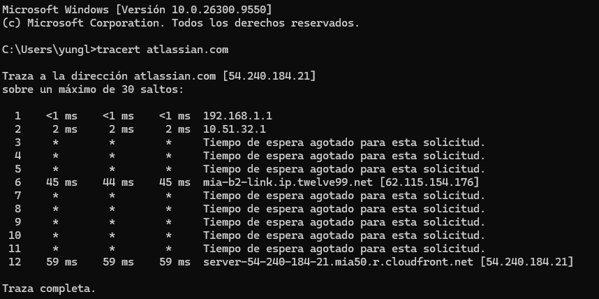
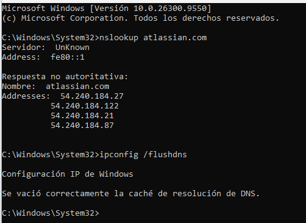

# 🌐 Manual de Herramientas de Diagnóstico de Redes y Operaciones del NOC
Este módulo contiene la documentación técnica y las evidencias de mis prácticas avanzadas en la consola de comandos de Windows (CMD), orientadas al monitoreo de infraestructura de red, análisis de rutas de tránsito internacional y resolución de resolución de nombres de dominio (DNS) para Operaciones de Red (NOC) y Mesa de Ayuda.

---

## 📋 Laboratorio 5.1: Análisis de Enrutamiento y Trazabilidad de Rutas (`tracert`)
**Objetivo:** Rastrear el flujo de paquetes de datos desde la red de área local (LAN) residencial hasta un nodo de red de distribución de contenido (CDN) internacional, interpretando variaciones de latencia e identificando políticas de seguridad ICMP en tránsito.

### ⚙️ Interpretación Técnica del Análisis de Trazabilidad Realizado:
Al ejecutar el comando `tracert atlassian.com` hacia la infraestructura de producción del servidor de destino, se extrajo la siguiente matriz de saltos de red lógicos:

1. **Salto 01 (Gateway Local - `192.168.1.1`):** Conectividad inmediata con el enrutador físico perimetral local (LAN). Latencia óptima inferior a `<1ms`, confirmando la estabilidad del canal base de Capa 1 y Capa 2.
2. **Salto 02 (Nodo del ISP - `10.51.32.1`):** Tránsito exitoso hacia la red de agregación del proveedor de internet local mediante enrutamiento privado.
3. **Saltos 03, 04, 05 (Políticas de Seguridad Drop ICMP):** La presencia de asteriscos (`*`) e indicaciones de tiempo de espera agotado confirman routers troncales con directivas de ciberseguridad activadas (Firewall Drop Rules). Los equipos procesan el paquete pero mitigan el riesgo de escaneo bloqueando respuestas ICMP Echo Reply sin interrumpir el flujo WAN.
4. **Salto 06 (Tránsito Internacional Inter-AS - `mia-b2-link.ip.twelve99.net`):** El paquete cruza el canal internacional de fibra óptica submarina tocando tierra en el punto de presencia (PoP) de **Miami, Florida (EE. UU.)** gestionado por el sistema autónomo de *Arelion*. El salto cuantitativo de latencia a **45ms** valida el factor físico de distancia y el retardo de propagación a través de la red WAN.
5. **Salto 12 (Destino Final - `cloudfront.net` / `54.240.184.21`):** Conclusión de la traza de forma exitosa en el clúster de servidores perimetrales de Amazon Web Services (AWS / Cloudfront) en la región norteamericana, con una latencia total estabilizada en **59ms**.

---

## 📸 Evidencia 01: Análisis de Tránsito WAN (`tracert`)
A continuación se adjunta el registro del análisis procedimental ejecutado desde la terminal de comandos del sistema:

---

## 📋 Laboratorio 5.2: Resolución de Nombres e Interrogación de Servidores DNS (`nslookup` & `/flushdns`)
**Objetivo:** Auditar la asignación de registros de resolución de nombres lógicos a direcciones IP físicas e implementar directivas de mitigación ante corrupción de caché local elevando privilegios del sistema.

### ⚙️ Procedimiento Operativo y Diagnóstico:
1. **Auditoría de Registros DNS (`nslookup`):** Se ejecuta la consulta interactiva hacia el dominio base. El sistema interroga al resolvedor local retornando las cuatro direcciones IPv4 de producción (`54.240.184.27`, etc.) asignadas dinámicamente al clúster perimetral por las políticas de balanceo de carga del host externo, descartando envenenamientos de DNS (DNS Spoofing).
2. **Mitigación de Errores de Caché Local (`ipconfig /flushdns`):** Ante escenarios de desactualización de registros locales o redireccionamientos fallidos post-migración en estaciones de trabajo, se requiere forzar la purga del sistema.
3. **Seguridad del Sistema (Elevación de Privilegios):** Debido a que la manipulación de las tablas lógicas de red altera el comportamiento del adaptador del sistema operativo, el comando restringe su acceso base. Se requiere invocar el Símbolo del Sistema mediante la directiva de seguridad de Windows **"Ejecutar como Administrador" (Elevated Mode)**. Una vez concedido el token de seguridad, se ejecuta la purga vaciando con éxito la caché de resolución del resolvedor local.

---

## 📸 Evidencia 02: Auditoría y Purga Exitosa de Caché DNS
Captura del Símbolo del Sistema en modo elevado confirmando la correcta traducción de registros del dominio y el vaciado exitoso de la caché del resolvedor de Windows:

